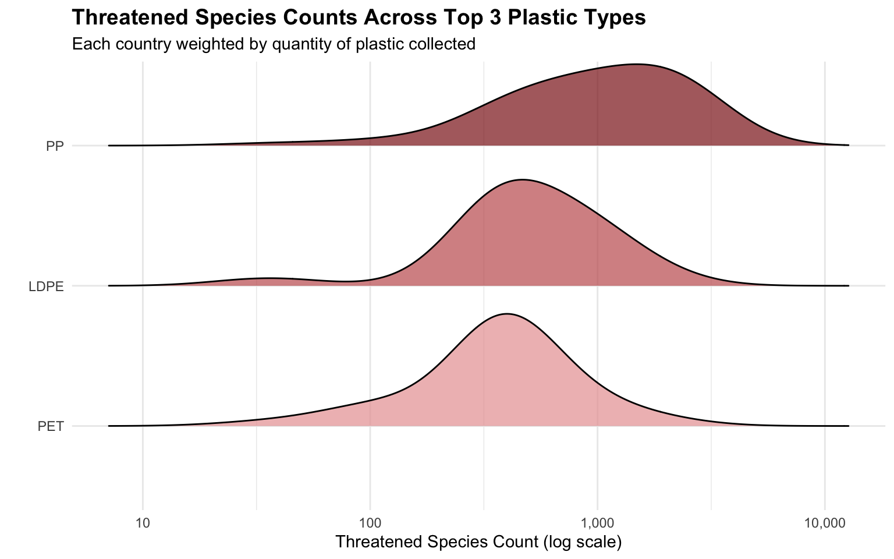

# Visualizing Plastics: What Global Plastic Audits Reveal

### 📄 [Read the full report →](https://tsobazy.github.io/Plastic-Waste-Analysis/)

Using volunteer-collected brand audit data from 2019–2020, we investigated
whether volunteer participation influences the amount of polyethylene plastic
collected, and whether country-level environmental indicators — forest coverage
and threatened-species count — are associated with which types of plastic
dominate a country's waste stream.

| | |
|---|---|
| **[`FinalDeliverable.qmd`](FinalDeliverable.qmd)** | The full written analysis |
| **[`Dashboard.qmd`](Dashboard.qmd)** | Interactive Quarto + Shiny companion, with a state-level case study of India |

<p align="center">
  
</p>

## What we found

**Volunteer count doesn't explain much.** Countries with more volunteers did
tend to report higher polyethylene proportions, but the relationship was weak
and inconsistent. Indonesia had among the highest average volunteers yet
reported only 4.25% HDPE, one of the lowest in the dataset.

**Environmental context told a clearer story.** PET proportion drops
consistently as threatened-species count increases — 71.7% in the low tier,
38.3% in the medium, 21.5% in the high. Countries with low forest coverage and
few threatened species were consistently PET-dominated; countries with more of
either showed more varied composition.

**The model supported it, partly.** Threatened-species count explains 12.5% of
the variation in PET proportion (F = 5.841, p = 0.0209, estimate = −0.1325).
Forested area pointed the same direction but fell short of significance
(p = 0.0794). The full model explains about 23% of the variation, leaving most
of it unexplained.

## Data

- **Plastic brand audits** — Break Free From Plastic 2019–2020, cleaned and
  compiled by Sarah Sauve. Observational and self-reported.
- **Country indicators** — [API Ninjas Country API](https://api-ninjas.com/api/country),
  for forest coverage, threatened-species count, and GDP per capita.
- **India state waste** — [Press Information Bureau, Government of India](https://www.pib.gov.in/PressReleasePage.aspx?PRID=1943210&reg=3&lang=2),
  scraped at render time for the dashboard.
- **Boundaries** — [GADM](https://gadm.org/) v4.1. Downloaded on first render,
  not committed, since GADM restricts redistribution.

## Limitations

The data depends on where volunteers are located, so accessible areas are
over-represented. It is self-reported, so we cannot verify accuracy, and
classification may vary between reporting groups. Not all countries have data
for both years. Some countries recorded nothing for certain plastic types, and
because genuine zeros and missing values are indistinguishable in the source,
those were excluded from proportion calculations rather than treated as zero.

## Built with

Quarto (`html` and `dashboard` with `server: shiny`) · `httr`/`jsonlite` for the
API · `rvest` for scraping · `dplyr`/`tidyr`/`purrr` · `lm()` with `broom` ·
`ggplot2`, `ggridges`, `ggrepel`, `plotly` · `gt` · `sf`/`leaflet`

## Running it

Requires R (≥ 4.3) and [Quarto](https://quarto.org/docs/download/).

```r
install.packages(c(
  "tidyverse", "glue", "gt", "plotly", "scales", "ggridges", "broom",
  "ggrepel", "rvest", "httr", "jsonlite", "geodata", "leaflet", "sf", "shiny"
))
```

```bash
quarto render FinalDeliverable.qmd
quarto serve  Dashboard.qmd
```

## My contribution

Four-person project for STAT 431 (Advanced R) at Cal Poly. Line counts are from
`git blame -w -M -C` and the history is public.

- **`FinalDeliverable.qmd` — 865 of 1000 lines (~86%).** The API acquisition and
  merge, country-name standardization, both research questions, the
  `plastic_ecology` summary function and quantile tiering, the `gt` tables, and
  the density ridge analysis.
- **`Dashboard.qmd` — 479 of 695 lines (~69%).** Layout and reactive wiring, the
  RQ2 bubble plot and the summary table behind it, and the India case study
  (152 of its 155 lines).

`Report.qmd` in this repo is the earlier **Project 1** and is shared work —
Nathan Lee and Noah Nayve wrote most of it.

## Team

Nathan Lee · Noah Nayve · Ryan Ekdahl · Taiga Sobajima
Cal Poly San Luis Obispo — STAT 431, Spring 2026

## License

MIT — see [LICENSE](LICENSE). Covers the code here; the datasets are governed by
their own terms, linked above.
